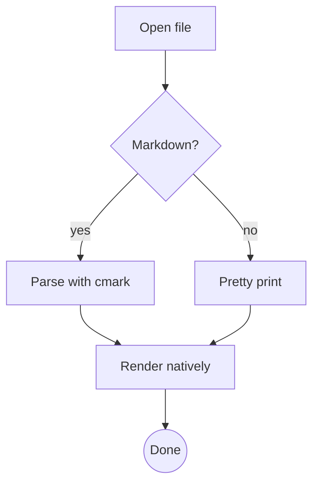
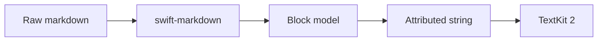
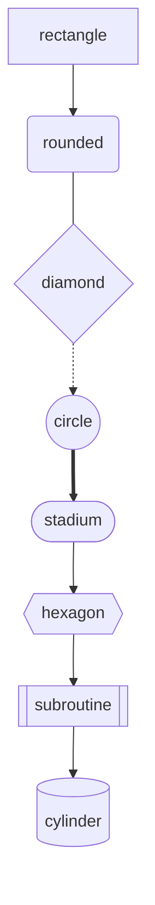
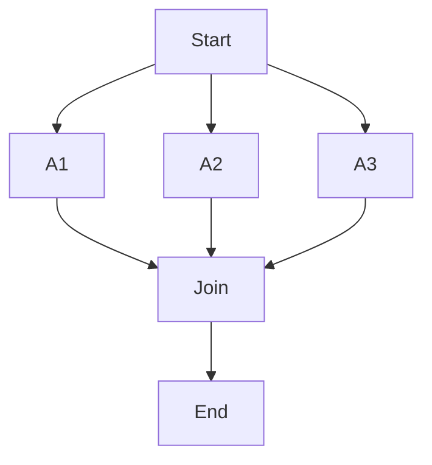
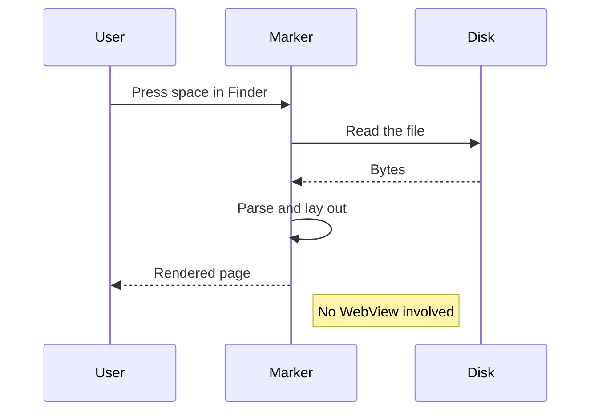
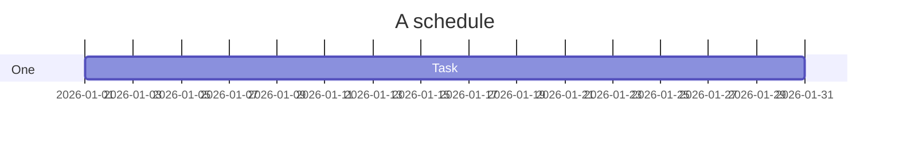

# Diagrams

## Flowchart, top down



## Flowchart, left to right



## Every shape and edge style



## A wider graph



## Sequence



## Unsupported, on purpose



## Broken, on purpose

```mermaid
graph TD
    A --> 
```
