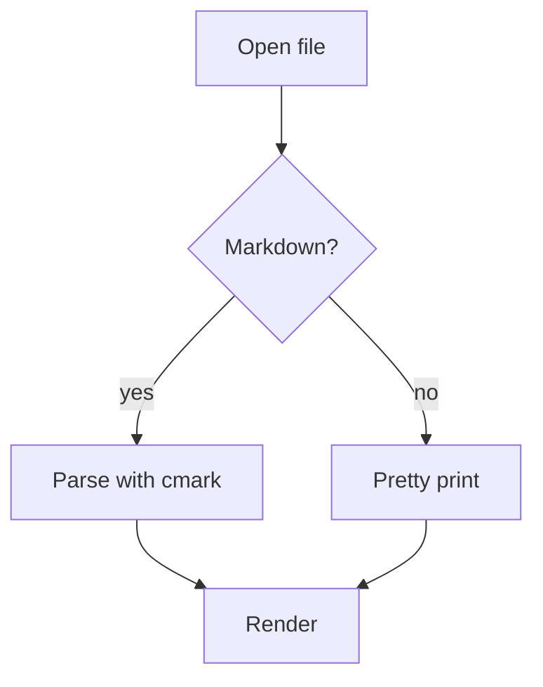

# Marker kitchen sink

Every construct the renderer must handle, in one file. If a screenshot of this
page looks right, most of the `REN` rows are right.

## Inline styles

Plain text with *emphasis*, **strong**, ***both***, ~~struck through~~, `inline
code`, a [link](https://example.com), and a footnote reference[^1].

[^1]: The footnote body.

## Lists

- First item
- Second item with a longer line that has to wrap somewhere sensible rather than
  running off the edge of the page
  - Nested item
  - Another nested item
- Third item

1. Ordered one
2. Ordered two
3. Ordered three

- [ ] Unchecked task
- [x] Checked task

## Quote

> A block quote, which should get a bar down its left edge.
>
> With a second paragraph inside it.

## Code

```swift
struct MarkdownSource: Sendable {
    private(set) var text: String

    mutating func apply(_ edit: TextEdit) -> TextEdit {
        // The raw string is the source of truth.
        return inverse(of: edit)
    }
}
```

```python
def layered_layout(nodes, edges):
    ranks = {n: longest_path(n) for n in nodes}
    return order_by_barycenter(ranks, edges)
```

## Table

| Feature | Free | Pro | Notes |
|:--------|:----:|----:|-------|
| Render markdown | yes | yes | Always free |
| Mermaid diagrams | yes | yes | Flowchart and sequence in v1 |
| Edit text | no | yes | Writes clean markdown back |
| Edit tables | no | yes | Cells and columns |

## Math

Inline math like $E = mc^2$ inside a sentence, and a display block:

$$
\int_{0}^{1} x^2 \, dx = \frac{1}{3}
$$

## Diagram



## Rule

---

Text after a thematic break.
