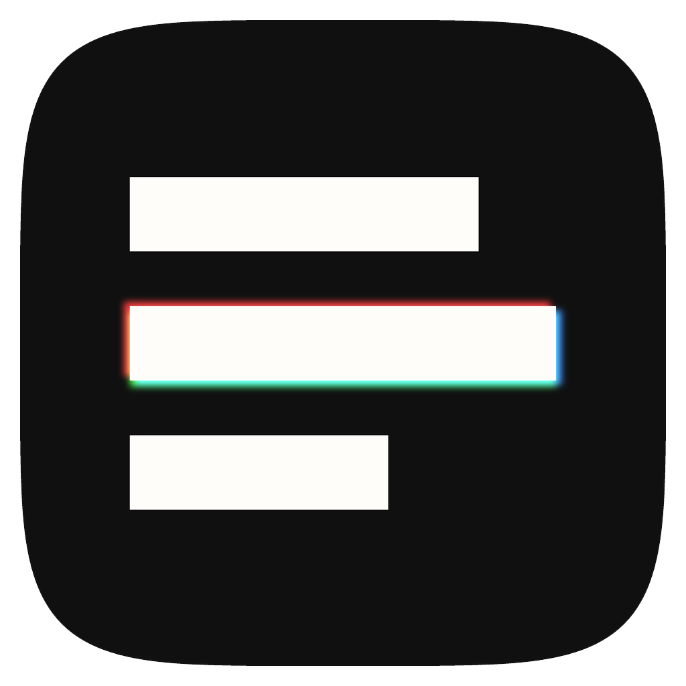
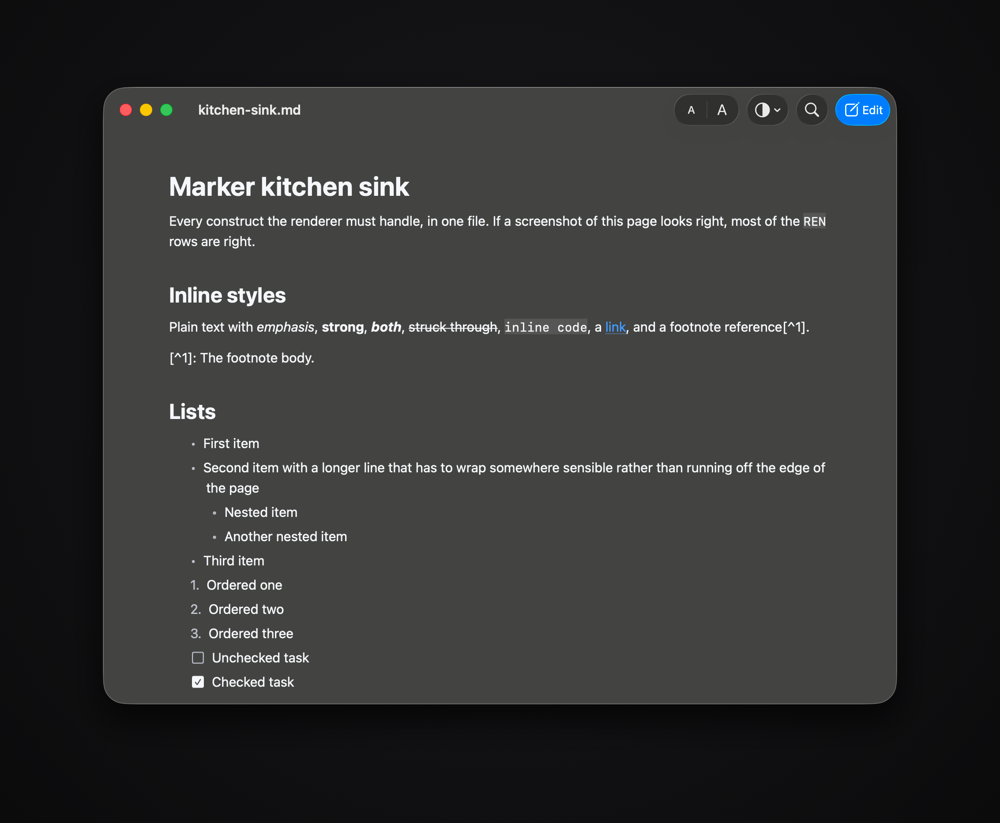
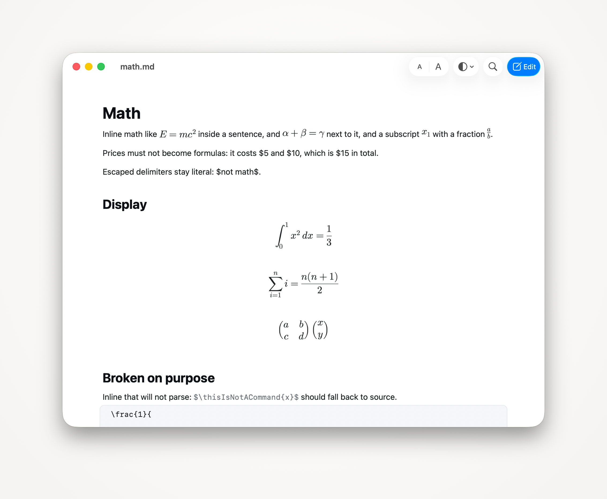
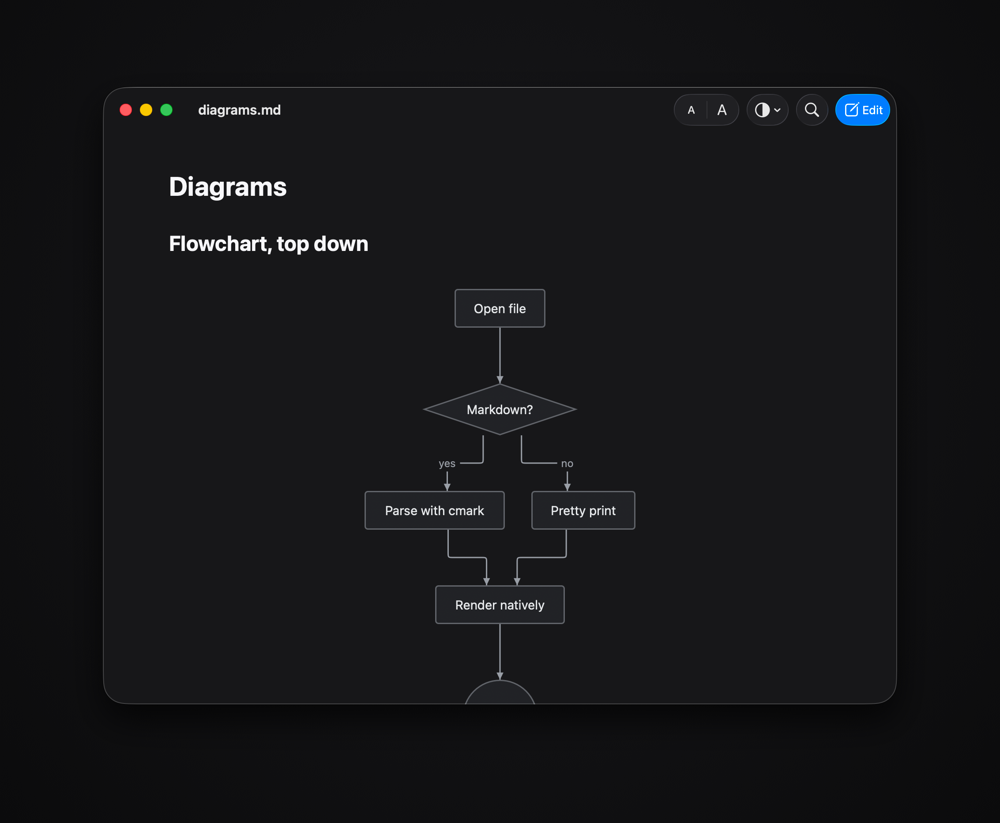
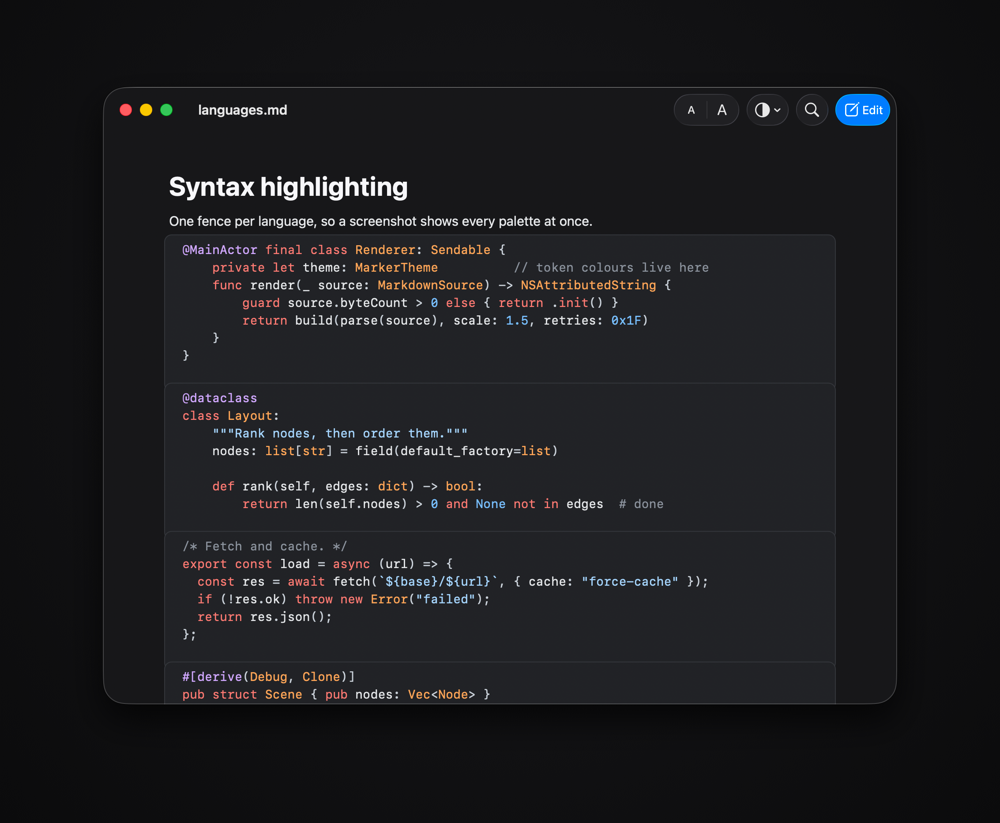
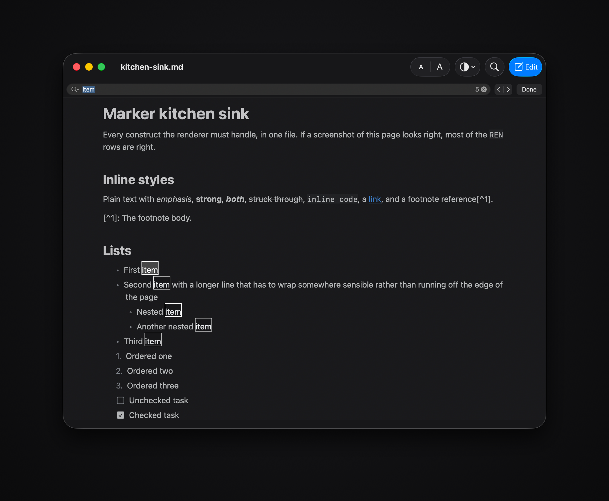
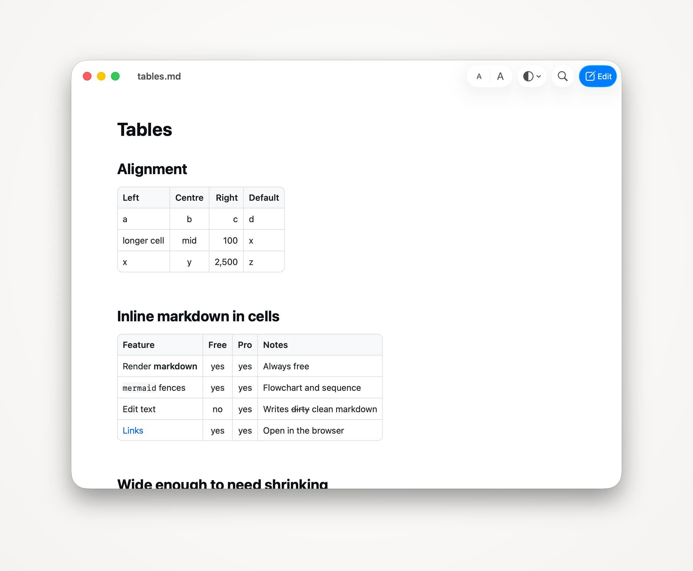
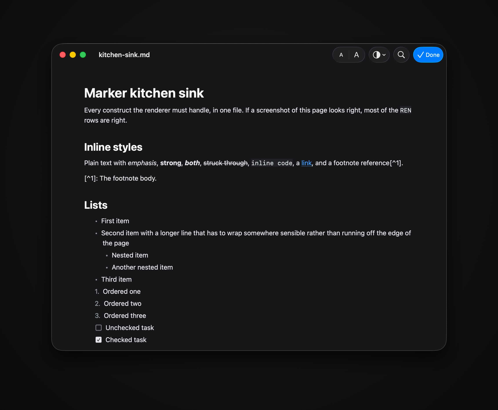
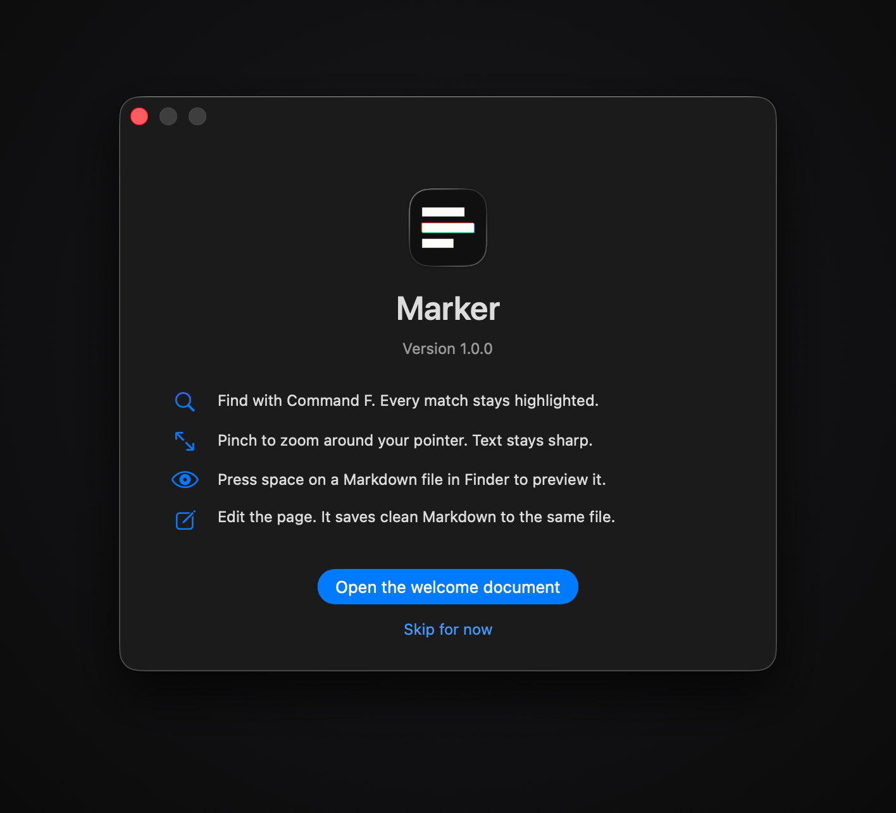

<p align="center">
  
</p>

<h1 align="center">Marker</h1>

<p align="center">
  A native macOS Markdown viewer and editor. It renders CommonMark and GFM
  properly, typesets LaTeX, draws Mermaid diagrams, previews in Quick Look, and
  edits the rendered page while writing clean Markdown back to the same file.
  There is no WebView in the binary.
</p>

<table>
  <tr>
    <td></td>
    <td></td>
  </tr>
</table>

Most Markdown apps on the Mac are a web page in a window. Marker is one TextKit 2
text view. That choice is the whole product: find, selection across mixed content,
the caret, undo, VoiceOver and copy all come from AppKit rather than from
reimplementation, and the page scrolls the way every other Mac document scrolls.

Three appearances. Liquid Glass follows the system and makes the window
translucent, so the page sits on whatever is behind it. Dark and Light are opaque.
Glass is a material rather than a third palette, which is what it is on macOS 26;
modelling it as a palette was the first version's bug, and both settings resolved
to the same colours.

<table>
  <tr>
    <td></td>
    <td></td>
  </tr>
</table>

Mermaid is a Swift layout engine, not a JavaScript library in a hidden browser.
Flowcharts rank by longest path and order by barycentre; sequence diagrams place
their own lifelines. It covers `flowchart` and `sequenceDiagram`, and anything else
renders as a styled code block that says so rather than as an empty box. Math goes
through SwiftMath to a real image. Code is a hand written tokenizer over fourteen
languages, which is there because pulling in highlight.js would have meant shipping
JavaScriptCore to colour a fenced block.

<table>
  <tr>
    <td></td>
    <td></td>
  </tr>
</table>

Command F highlights every match on the page, not just the one you are standing on.
That is `NSTextFinder` doing its job, which it can only do because the document is
real text in a real text view.

<table>
  <tr>
    <td></td>
    <td></td>
  </tr>
</table>

Editing is the part that is easy to get wrong quietly. The raw text of your file is
the source of truth, never the attributed string, and every keystroke becomes a byte
splice into it. Only the bytes you changed change. Setext headings stay setext, `*`
bullets stay `*`, your table padding survives, and raw HTML and front matter pass
through untouched. Open a README you track in git, fix one typo, and the diff is one
line.

When an edit cannot be mapped back to the source safely, it is refused and the
window subtitle says why, rather than being guessed at. Bullets, ordinals and
checkboxes are drawn from the Markdown and are not typed over; tables, diagrams and
formulas are edited through the Markdown source view. A wrong guess in that code
path corrupts a file silently, and a file the user cannot get back is worse than a
keystroke that does not land.

Everything is free. Nothing phones home except an update check you can turn off, and
remote images are a setting because a Markdown viewer that fetches URLs is a tracking
pixel waiting to happen.

## Build

There is no checked in Xcode project. `Marker.xcodeproj` is generated by XcodeGen
from `project.yml`, so a fresh clone has nothing to open until you run step two.

```bash
brew install xcodegen
xcodegen generate
xcodebuild -project Marker.xcodeproj -scheme Marker -configuration Debug build
```

Tests are two commands, because XcodeGen cannot list a local package's test targets
in an Xcode scheme and the package tests are the heaviest coverage in the repo:

```bash
Scripts/test.sh          # 189 package tests, then 16 app tests
```

Quick Look needs the app registered with LaunchServices before the extension
appears:

```bash
cp -R build/.../Marker.app /Applications/
open /Applications/Marker.app
qlmanage -r && qlmanage -r cache
```

## Layout

`Packages/MarkerKit` holds two library targets and the app and the Quick Look
extension both depend on it. `MarkerCore` has no AppKit at all: the document model,
the parser bridge, the highlighter, the table model and the entire Mermaid engine
live there, which is what lets `swift test` exercise diagram geometry and source
range mapping in under a second with no app host. `MarkerRender` is the AppKit half:
the theme tokens, the attributed string builder, the text view and the drawing.

`Marker/` is app only. `ARCHITECTURE.md` covers why the source string is the source
of truth and how the coordinate spaces stay apart.

## Screenshots

Every image above is regenerated by one command:

```bash
Scripts/make-docs-images.sh
```

It captures each window through the window server, so the traffic lights, the corner
radius and the drop shadow are macOS drawing itself rather than a frame drawn to look
like one, then stands the result on a backdrop. Captures are always scoped to a
single window by id. Full screen and region capture are not used anywhere in this
repo, deliberately: both photograph whatever else happens to be open.

## License

MIT. See `LICENSE`.
